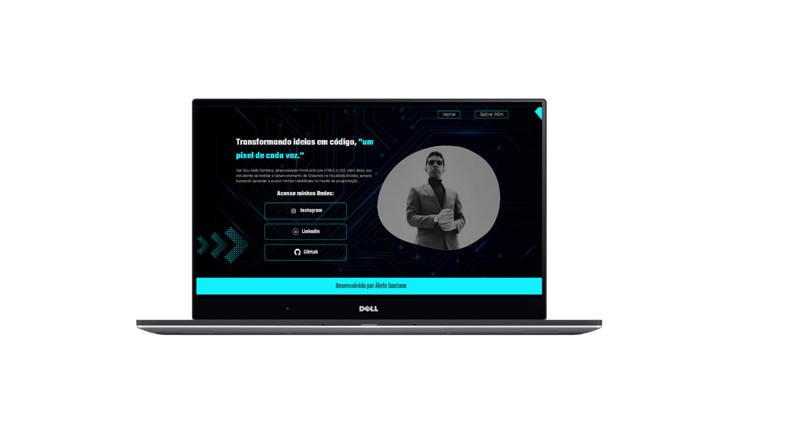
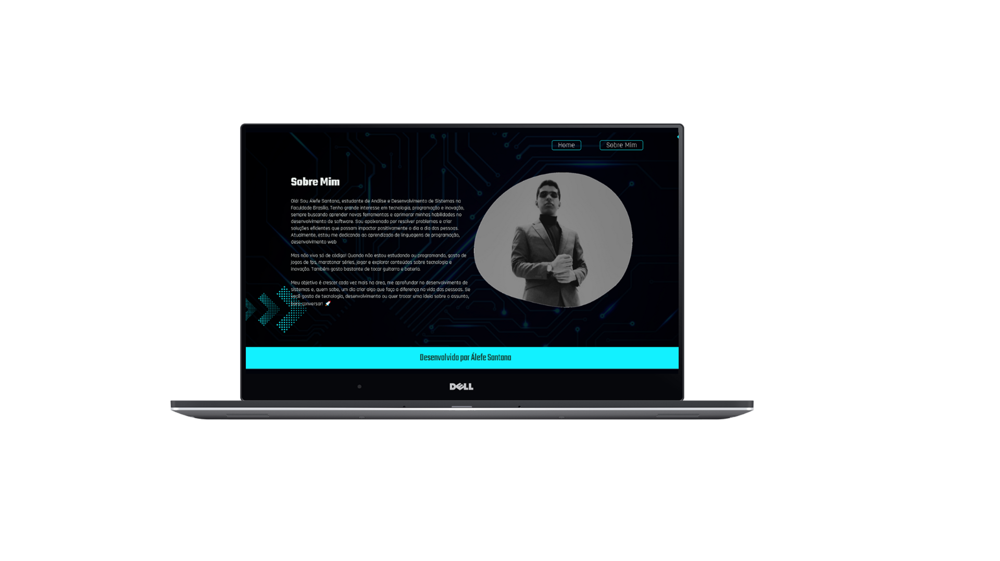

# 💼 Portfólio Pessoal - Álefe Santana

Bem-vindo ao meu portfólio! Este projeto foi desenvolvido com o objetivo de apresentar minhas habilidades em **desenvolvimento front-end**, bem como compartilhar um pouco sobre minha trajetória como estudante de **Análise e Desenvolvimento de Sistemas**.

## 🚀 Tecnologias Utilizadas

- HTML5
- CSS3
- Flexbox
- Media Queries (responsividade)
- Fontes do Google Fonts
- Imagens e ícones personalizados

## 📱 Responsividade

O site é **totalmente responsivo**, com uma versão de layout adaptada para dispositivos móveis, garantindo uma boa experiência tanto em desktops quanto em celulares.

## 🔗 Acesse o Portfólio

Você pode ver o projeto em funcionamento clicando aqui:  
➡️ [Link: https://alefe-sds.github.io/portfolio/](https://alefe-sds.github.io/portfolio)

## 📂 Estrutura de Pastas
```bash
/assets                 # Imagens e ícones usados no site
│
├── backgroudcell.png        # Fundo para celular (versão 1)
├── backgroudcell2.png       # Fundo para celular (versão 2)
├── backgroudimg.png         # Fundo desktop (versão 1)
├── backgroudimg2.png        # Fundo desktop (versão 2)
├── github.png               # Ícone do GitHub
├── imgAlefe.png             # Foto do Álefe (versão 1)
├── imgAlefe2.png            # Foto do Álefe (versão 2)
├── imgbackgroud.jpg         # Outra imagem de fundo
├── imgTeclado.png           # Imagem de teclado
├── instagram.png            # Ícone do Instagram
└── linkedin.png             # Ícone do LinkedIn

/styles                 # Estilos do site
└── style.css                # Arquivo principal de estilos

index.html              # Página inicial do portfólio
sobreMin.html           # Página “Sobre Mim”
```

## 🧠 Sobre Mim

Olá! Me chamo **Álefe Santana** e sou apaixonado por transformar ideias em código, "um pixel de cada vez". Estou sempre estudando e buscando evoluir no universo da programação.

## 📷 Prints do Projeto

### 🏠 Página Inicial




### 🙋 Sobre Mim



## 📷 Prints do Projeto mobile

## 📫 Contato

- Instagram: [@alefe__santana](https://instagram.com/alefe__santana)
- LinkedIn: [Álefe Santana](https://www.linkedin.com/in/álefe-santana-603377161/)
- GitHub: [Alefe-SdS](https://github.com/Alefe-SdS)

## 📄 Licença

Este projeto é de uso pessoal e está aberto para fins de estudo. Sinta-se livre para se inspirar e aprender!

---

✨ Desenvolvido por **Álefe Santana**

